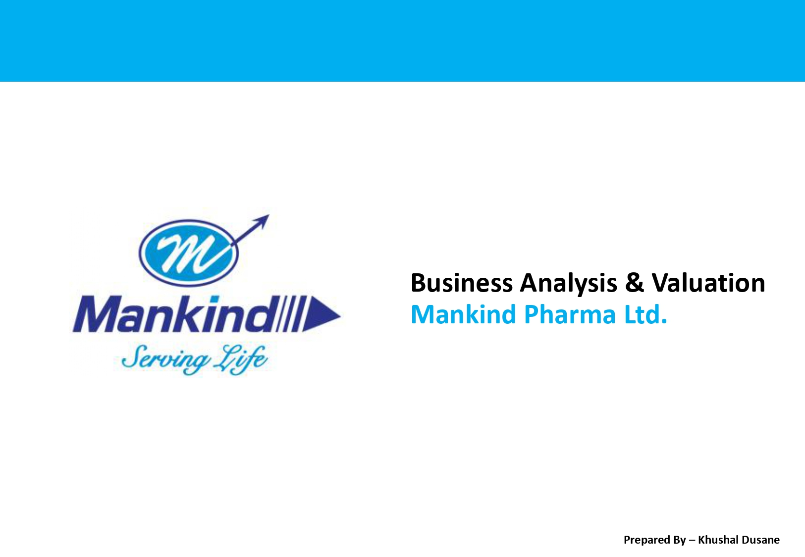

# Mankind Pharma – Financial Model

This project contains a financial model and analysis of Mankind Pharma.

## Click below to view the presentation

  

## 📁 Contents
Annual Report – Company annual reports
Concalls – Earnings call information
Damodaran – Industry and valuation data
FS Data – Financial statement data
Trendlyne reports – Company research and market data
MD&A PDFs – Management discussion and analysis
Investor Presentation – Company presentations
Mankind Pharma.xlsx – Main financial model
Mankind Report.pdf – Company report
Pharma Industry Report – Industry research

## 📊 Purpose
The model is created to study:

Historical financial performance
Revenue and profitability
Financial statements
Valuation
Industry trends
Future business performance
🛠️ Tools
Microsoft Excel
Company Annual Reports
Investor Presentations
Earnings Calls
Industry & Market Research

## How to Use ?
Open the **Mankind Pharma.xlsx** and you can try the available assumptions and analyze through the presentation **Mankind Report.pdf** for better understanding .

## Note: This project is for educational and financial analysis purposes only .

## 👤 Author
# Khushal Dusane
This repository represents my work and learning in financial modeling, Excel dashboards, financial analysis, and data visualization.

⭐ If you find this repository useful, feel free to explore the projects and follow the repository for future updates.

